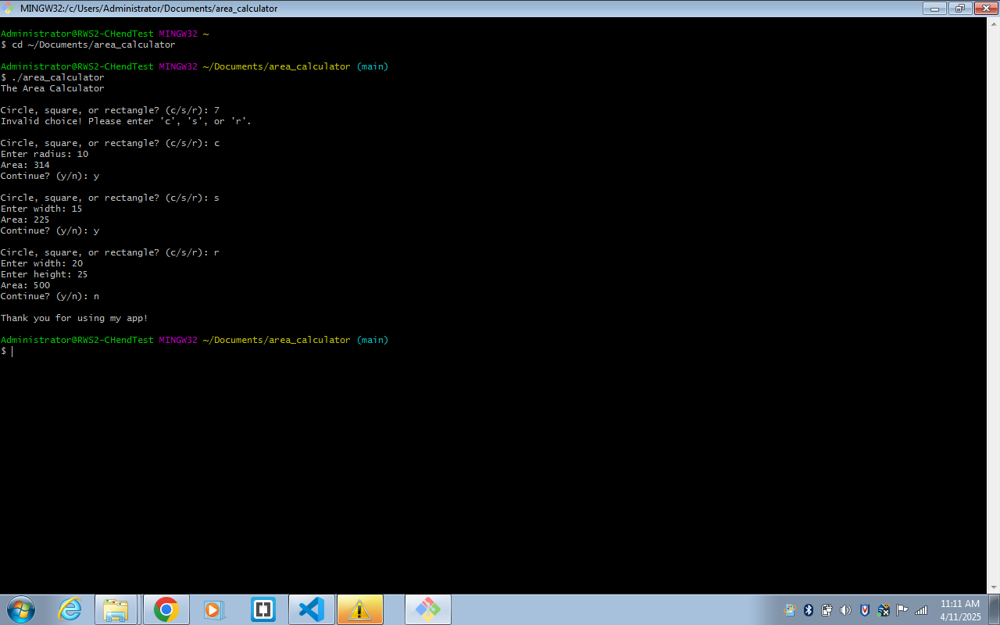

# Area Calculator

A simple C++ console application that calculates the area of **circle**, **square**, and **rectangle** shapes.

Built using **Object-Oriented Programming (OOP)** principles like inheritance, abstraction, and polymorphism. It also includes **input validation** and loops until the user decides to exit.

---

## Features
- Calculate area for:
  - Circle: π × r²
  - Square: width²
  - Rectangle: width × height
- Input validation: handles invalid shape options
- Simple text-based interface
- Loops until the user chooses to quit
- Clean program exit

---


## How to Run

1. **Compile the program**:
   ```bash
   g++ area_calculator.cpp -o area_calculator

./area_calculator

## Screenshot

Here’s an example of the program running with valid and invalid inputs:


